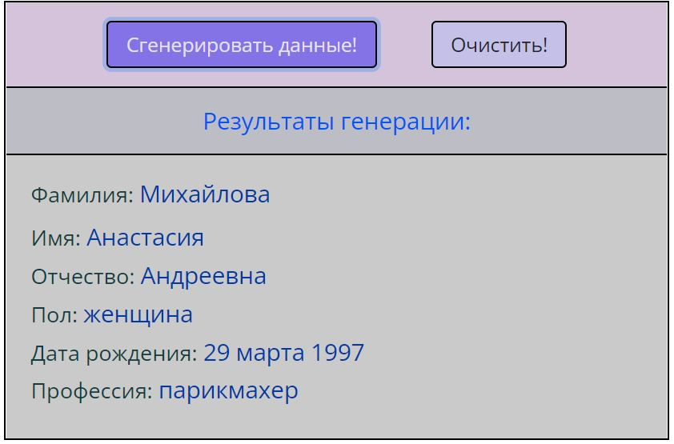

# Проект Генератор случайных пользовательских данных/ Project Random personal date generator

Разработан в качестве практического задания на курсе "SkillFactory: PHPPRO
**Профессия Fullstack веб-разработчик на JavaScript и PHP**".
Создание генератора случайных пользовательских данных: ФИО, пола, даты рождения и профессии. С возможностью сбрасывать информацию. Выбор данных происходит из заготовленных JSON значений с помощью Math.random. Основа для выполнения работы находится здесь: https://github.com/SkillfactoryCoding/php/tree/master/bjs/10_function_object

Completed as a practical task on the course "SkillFactory: PHPPRO
**Profession Fullstack web developer in JavaScript and PHP**". To create a generator of random personal user data: full name, gender, date of birth and profession. With the ability to reset information. The selection of data comes from prepared JSON values using Math.random. The basis for doing the work is here: https://github.com/SkillfactoryCoding/php/tree/master/bjs/08_if_else

---

Выполнено самостоятельно: 

* CSS-оформление

* генерация пола

* генерация фамилии (женскую фамилию нельзя писать в JSON, она должна происходить из предоставленных мужских фамилий с изменением окончания)

* генерация отчества (в зависимости от пола)

* генерация профессии (в зависимости от пола)

* генерация года, дня и месяца рождения (месяц рождения написан "текстом", ограничение дней для месяцев, в которых встречается 28 и 30 дней)

* кнопкa «Сгенерировать данные!»

* кнопкa «Очистить!»
 

Done by myself:

* CSS styling

* generate of gender

* generate of surname (the female last name cannot be written in JSON, it must create from the provided male names with a changes)

* generate of secondname  (by gender)

* generate of profession (by gender)

* generate of year, day and month of birth (month of birth must be written in "text", limit for months that have 28 and 30 days)

* button code «Create!»

* button code «Clear!»
---

На русском языке/Russian language

---

## Используемые технологии/Technologies used

* HTML

* CSS

* Java Script

* JSON

---

## Cкриншот/Screenshot

---

## Как запустить/How to run

Зайти в папку сайта в файловом менеджере, кликнуть 2 раза по файлу index.html./Go to the site folder in the file manager, double-click on the index.html file.

---

## Автор/Author
SofMik, начинающий веб-разработчик/SofMik, student web developer